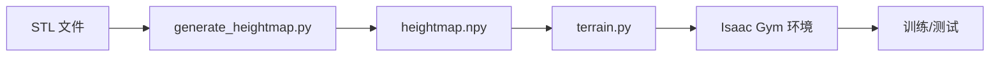

# Terrain Assets for STL 地形使用指南

## 目录

1. [概述](#概述)
2. [依赖环境](#依赖环境)
3. [地形添加方法](#地形添加方法)
4. [使用方法](#使用方法)
5. [测试验证](#测试验证)
6. [注意事项](#注意事项)
7. [故障排除](#故障排除)

---

## To Do

- [ ] 适配Issac Sim
- [ ] 添加更多示例和配置

## 概述

本指南介绍如何在 Issac Gym(legged_gym) 相关项目中使用 STL mesh 地形。该功能允许用户从 STL 文件加载复杂的三维地形，同时生成对应的 heightmap 用于机器人地形观测。由于本项目目前只针对 基于 legged_gym 项目开发，其他项目可能需要额外的配置和调整，后续会尽量完善该项目。

### 主要特性

- ✅ 支持 STL 格式的 3D mesh 地形
- ✅ 自动生成 heightmap 用于地形观测
- ✅ 自动单位转换（mm → meters）
- ✅ 自动居中到地形中央
- ✅ Watertight 检查
- ✅ 完全兼容现有 terrain 系统

### 两种使用模式

本项目提供两种使用 STL 地形的方式：

`mesh_type`参数需要在`legged_robot_config.py`中配置。

#### 模式 1: mesh_heightmap（独立地形模式）
- 设置 `mesh_type = "mesh_heightmap"`
- 整个地形区域使用单一的 STL mesh
- 适合训练特定的 STL 地形
- 配置简单，无需修改地形比例

#### 模式 2: 程序化地形混合模式（优先）
- 保持 `mesh_type = "trimesh"` 或其他程序化地形类型
- 在 `terrain_dict` 中添加 STL 地形条目
- STL 地形可以与其他程序化地形混合使用
- 适合 curriculum 训练和多地形场景
- 需要调整 `terrain_proportions`

### 当前地形配置

- **地形尺寸**: 18m × 4m
- **水平分辨率**: 0.02m
- **垂直分辨率**: 0.005m
- **地形类型**: 默认 `trimesh`（可使用 STL 地形作为其中一种地形）

---

## 依赖环境

### 必需的 Python 包

```bash
pip install trimesh rtree -i https://pypi.org/simple
```

#### 依赖说明

| 包名 | 版本要求 | 用途 |
|------|---------|------|
| trimesh | >= 4.0 | STL mesh 加载和处理 |
| rtree | >= 1.0 | 空间索引（trimesh 依赖） |
| numpy | < 2.0 | 数值计算（兼容性要求） |

### NumPy 版本注意事项

由于 SciPy 版本兼容性问题，建议使用 NumPy 1.x 版本：

```bash
# 如果当前 NumPy 版本 >= 2.0，请降级
pip install "numpy<2" -i https://pypi.org/simple
```

### 验证安装

```bash
python -c "import trimesh; import rtree; print('依赖安装成功')"
```

---

## 地形添加方法

### 模式 1: 使用 mesh_heightmap（独立地形模式）

#### 步骤 1: 生成 heightmap

```bash
cd legged_gym/legged_gym/terrain_assets
python generate_heightmap.py --stl_path T_step.STL --output heightmap.npy --terrain_size 5.0 --resolution 0.02
```

#### 步骤 2: 配置地形

在 `legged_robot_config.py` 中配置：

```python
class terrain:
    mesh_type = "mesh_heightmap"
    terrain_length = 5.0
    terrain_width = 4.0
    horizontal_scale = 0.02
    vertical_scale = 0.005
    stl_path = "legged_gym/legged_gym/terrain_assets/T_step.STL"
    heightmap_path = "legged_gym/legged_gym/terrain_assets/heightmap.npy"
```

#### 后续与模式 2 相同

### 模式 2: 使用程序化地形混合模式（优先）

#### 步骤 1: 生成 heightmap

```bash
cd legged_gym/legged_gym/terrain_assets
python generate_heightmap.py --stl_path T_step.STL --output T_step_heightmap.npy --terrain_size 5.0 --resolution 0.02
```

#### 步骤 2: 在 terrain.py 中添加配置

编辑 `legged_gym/legged_gym/utils/terrain.py`，在 `STL_TERRAIN_CONFIG` 中添加：

```python
class Terrain:
    STL_TERRAIN_CONFIG = {
        "T_step_stl": {
            "heightmap_path": "legged_gym/legged_gym/terrain_assets/T_step_heightmap.npy",
            "display_name": "T_step"
        },
    }
```

#### 步骤 3: 在 make_terrain 中添加处理逻辑

```python
elif choice < self.proportions[22]:
    idx = 23
    stl_config = self.STL_TERRAIN_CONFIG.get("T_step_stl")
    if stl_config:
        stl_heightmap_terrain(
            terrain,
            terrain_name=stl_config["display_name"],
            stl_heightmap_path=stl_config["heightmap_path"]
        )
```

#### 步骤 4: 在配置文件中添加地形类型

编辑 `legged_gym/envs/base/legged_robot_config.py`：

```python
terrain_dict = {
    # ... 其他地形类型 ...
    "T_step_stl": 0.1,  # 添加 STL 地形，比例为 10%
}
```
#### 步骤 5：在`Terrain.__init__`中添加STL地形配置
1. 方式1：mesh_heightmap模式

```
  #用于STL mesh地形 + heightmap观测：
    if self.type == "mesh_heightmap":
       # 1. 加载 STL mesh（用于物理仿真）
       self.vertices, self.triangles = load_stl_mesh(
           stl_path=stl_path,
           terrain_size=max(self.env_length, self.env_width),
           center_to_terrain=True
       )
       
       # 2. 加载 heightmap（用于观测）
       self.height_field_raw = load_heightmap(
        heightmap_path=heightmap_path,
        horizontal_scale=self.cfg.horizontal_scale,vertical_scale=self.cfg.vertical_scale
       )

```

2. 方式2：程序化地形中的STL
```
  #使用 stl_heightmap_terrain()函数将heightmap加载到程序化地形系统中：

   def stl_heightmap_terrain(terrain,
                             
   terrain_name="custom_stl",
                             
   stl_heightmap_path="...",
                             
   pad_width=0.1,
                             
   pad_height=0.0):
       # 1. 加载预生成的 heightmap
       heightmap = np.load(abs_path)
       
       # 2. 尺寸匹配（自动缩放或裁剪）
       if heightmap.shape != target_shape:
           heightmap = ndimage.zoom(heightmap, zoom_factor, order=1)
       
       # 3. 转换为 int16 高度场
       height_field_raw = (heightmap / terrain.vertical_scale).astype(np.int16)
       
       # 4. 复制到地形
       terrain.height_field_raw[:, :] = height_field_raw
       
       # 5. 边缘填充（防止机器人掉出）
       terrain.height_field_raw[:, :pad_width_int] = pad_height_int
       terrain.height_field_raw[:, -pad_width_int:] = pad_height_int
       terrain.height_field_raw[:pad_width_int, :] = pad_height_int
       terrain.height_field_raw[-pad_width_int:, :] = pad_height_int
``` 

### generate_heightmap.py 参数说明

| 参数 | 默认值 | 说明 |
|------|--------|------|
| `--stl_path` | `T_step.STL` | STL 文件路径 |
| `--output` | `heightmap.npy` | 输出的 heightmap 文件路径 |
| `--terrain_size` | `12.0` | 地形尺寸 [meters]，地形是正方形。当使用 `--auto_terrain_size` 时此参数被忽略 |
| `--resolution` | `0.02` | 分辨率 [meters] |
| `--z_offset` | `0.0` | z 轴偏移量 [meters]，mesh 中心在 z=0 平面 |
| `--rotation_angle` | `0.0` | 围绕中心轴顺时针旋转角度 [度]，默认不旋转 |
| `--x_offset` | `0.0` | 在 x 轴平移距离 [meters]，正数代表往图像右方移动 |
| `--y_offset` | `0.0` | 在 y 轴平移距离 [meters]，正数代表往图像上方移动 |
| `--auto_terrain_size` | `False` | **推荐使用**。自动根据模型实际尺寸计算 terrain_size，确保模型尺寸准确 |
| `--padding` | `0.5` | 边缘留白 [meters]，仅在 `--auto_terrain_size` 时有效 |

**重要提示**：
- 使用 `--auto_terrain_size` 可以确保 heightmap 的尺寸与模型实际尺寸一致，避免在不同分辨率下模型尺寸不准确的问题
- 如果不使用 `--auto_terrain_size`，需要手动设置合适的 `terrain_size`，否则模型可能在 heightmap 中占用很小的区域

**重要提示**：
- `terrain_size` 应与配置文件中的 `terrain_length` 和 `terrain_width` 保持一致
- `resolution` 应与 `horizontal_scale` 保持一致
- 对于 5m × 5m 地形，使用 `--terrain_size 5.0`

---

## 使用方法

### 基本使用流程



### 快速开始

#### 1. 准备环境

```bash
# 安装依赖
pip install trimesh rtree -i https://pypi.org/simple
pip install "numpy<2" -i https://pypi.org/simple
```

#### 2. 生成 heightmap

**推荐用法（自动计算 terrain_size，确保模型尺寸准确）：**
```bash
cd legged_gym/legged_gym/terrain_assets
python generate_heightmap.py \
    --stl_path T_step.STL \
    --output heightmap.npy \
    --resolution 0.02 \
    --auto_terrain_size \
    --padding 0.5
```

**使用旋转和平移（推荐配合 auto_terrain_size）：**
```bash
# 顺时针旋转 45 度
python generate_heightmap.py \
    --stl_path T_step.STL \
    --output heightmap_rotated.npy \
    --resolution 0.02 \
    --auto_terrain_size \
    --rotation_angle 45.0

# 旋转并平移
python generate_heightmap.py \
    --stl_path T_step.STL \
    --output heightmap_transformed.npy \
    --resolution 0.02 \
    --auto_terrain_size \
    --rotation_angle 30.0 \
    --x_offset 1.0 \
    --y_offset 0.5
```

**手动指定 terrain_size（需要确保 terrain_size 足够大）：**
```bash
python generate_heightmap.py \
    --stl_path T_step.STL \
    --output heightmap.npy \
    --terrain_size 18.0 \
    --resolution 0.02
```

**验证输出信息：**
生成 heightmap 后，请检查输出信息中的以下内容，确认模型尺寸准确：
- `Mesh 实际尺寸`: 模型的真实物理尺寸
- `Heightmap 物理尺寸`: heightmap 的物理尺寸（应与 terrain_size 一致）
- `模型在 heightmap 中的占用`: 模型占用的像素数
- `从像素计算的模型尺寸`: 应该与 `Mesh 实际尺寸` 一致

#### 3. 配置地形

根据选择的模式配置地形（参见上节）。

#### 4. 运行训练

```bash
cd legged_gym
python scripts/train.py --task=a1_parkour
```

#### 5. 运行测试

```bash
cd legged_gym
python scripts/play.py --task=a1_parkour
```

---

## 测试验证

### 1. 功能验证测试

验证 STL mesh 和 heightmap 加载功能：

```bash
cd legged_gym/legged_gym/terrain_assets
python verify_functions.py
```

**预期输出**：

```
============================================================
验证 STL mesh 加载功能
============================================================

[1] 测试 load_stl_mesh 函数...
正在加载 STL mesh: T_step.STL
Mesh bounding box: [[0.  0.  0. ]
 [2.8 0.4 1.9]]
转换后 Mesh bounding box: [[0.  0.  0. ]
 [2.8 0.4 1.9]]
Mesh 已居中到地形中央: (9.00, 2.00, 0.00)
Mesh 加载完成: 46 顶点, 88 三角形面

✓ load_stl_mesh 测试通过:
  顶点数: 46
  三角形面数: 88
  顶点 X 范围: [7.600, 10.400] m
  顶点 Y 范围: [1.800, 2.200] m
  顶点 Z 范围: [-0.950, 0.950] m

[2] 测试 load_heightmap 函数...
正在加载 heightmap: heightmap.npy
Heightmap 加载完成: shape=(900, 200)
Heightmap 范围: 0.000 ~ 0.950 meters

[3] 验证数据一致性...
  ✓ Mesh 和 Heightmap 高度值一致
  ✓ Mesh 已正确居中

✓ 所有测试通过！
```

### 2. 框架测试

测试 STL 地形配置框架：

```bash
cd legged_gym/legged_gym/terrain_assets
python test_stl_framework.py
```

**预期输出**：

```
============================================================
测试 STL 地形配置框架
============================================================

[1] STL_TERRAIN_CONFIG 配置:
  T_step_stl:
    heightmap_path: legged_gym/legged_gym/terrain_assets/T_step_heightmap.npy
    display_name: T_step

[2] 测试配置访问:
  ✓ 成功获取 'T_step_stl' 配置
  ✓ Heightmap 加载成功
    形状: (600, 600)
    范围: [0.000, 0.950] meters

[3] 测试添加新地形:
  ✓ 添加新地形: staircase_stl
  ✓ 新地形配置验证成功

[4] 测试地形比例配置:
  ✓ 配置管理正确

[5] 测试框架使用流程:
  ✓ 所有步骤验证通过

============================================================
✓ 所有测试通过！
============================================================
```

### 3. heightmap 预览
使用`visualize_heightmap.py`预览 heightmap 图像
```bash
cd legged_gym/legged_gym/terrain_assets
python visualize_heightmap.py --input heightmap.npy --save_path heightmap_visualization.png --view_type 2d
```

**关键参数**
- `--input`: heightmap 文件路径
- `--save_path`: 保存图像路径（默认: `heightmap_visualization.png`）
- `--view_type`: 视图类型（`2d` 或 `3d`，默认: `2d`）

### 4. 环境测试

在 Isaac Gym 环境中测试地形加载：

```bash
cd legged_gym
python scripts/play.py --task=a1_parkour
```

**检查要点**：
- 地形是否正确加载
- 机器人是否在地形上方初始化
- 地形观测是否正常工作

---

## 注意事项

### 1. STL 文件要求

#### 文件格式
- ✅ 支持 ASCII STL 和 Binary STL
- ✅ 建议使用 watertight mesh（封闭网格）
- ❌ 避免使用包含多个独立组件的 STL（应合并为一个 mesh）

#### 尺寸和单位
- **推荐单位**: meters
- **支持单位**: mm（会自动转换）

#### 质量
- 确保 mesh 法线方向正确
- 避免自相交
- 避免过于复杂的几何（会影响性能）

### 2. Heightmap 生成

#### 分辨率选择

| 分辨率 | 精度 | 计算量 | 适用场景 |
|--------|------|--------|---------|
| 0.01m | 高 | 大 | 需要高精度观测 |
| 0.02m | 中 | 中 | **推荐** |
| 0.05m | 低 | 小 | 快速测试 |

#### 尺寸准确性

**问题**：如果手动指定 `terrain_size` 且不使用 `--auto_terrain_size`，可能会导致模型在 heightmap 中的尺寸不准确。

**示例**：
- 模型实际尺寸：2.8m × 0.4m
- 手动设置 terrain_size：12m
- 当 resolution = 0.02m 时，heightmap = 600 × 600 像素
- 模型在 heightmap 中只占用：140 × 20 像素（很小一部分）

**解决方案**：使用 `--auto_terrain_size` 参数

```bash
# 自动计算 terrain_size，确保模型尺寸准确
python generate_heightmap.py \
    --stl_path T_step.STL \
    --output heightmap.npy \
    --resolution 0.02 \
    --auto_terrain_size \
    --padding 0.5
```

这样会自动：
1. 计算模型的实际尺寸（考虑旋转）
2. 加上 padding 留白
3. 计算合适的 terrain_size
4. 确保 heightmap 的尺寸与模型尺寸匹配

**输出验证**：
生成 heightmap 后，检查输出信息：
```
Mesh 实际尺寸: 2.800m × 0.400m
自动计算 terrain_size: 4.000m × 4.000m (padding: 0.500m)
Heightmap 物理尺寸: 4.000m × 4.000m
模型在 heightmap 中的占用: 140 × 20 pixels
从像素计算的模型尺寸: 2.800m × 0.400m  ✓ 与实际尺寸一致
```

#### 地形尺寸

```python
# 当前配置
terrain_length = 18.0  # 地形长度 [meters]
terrain_width = 4.0    # 地形宽度 [meters]

# heightmap 尺寸
heightmap_rows = int(terrain_length / horizontal_scale)  # 18.0 / 0.02 = 900
heightmap_cols = int(terrain_width / horizontal_scale)   # 4.0 / 0.02 = 200
```

**注意**: 更改地形尺寸后需要重新生成 heightmap。

### 3. 性能优化

#### Mesh 简化

如果 STL mesh 过于复杂，可以简化：

```bash
# 使用 MeshLab 或 Blender 简化 mesh
# 目标：顶点数 < 10000
```

#### 调整分辨率

根据性能需求调整 `horizontal_scale`：

```python
# 降低分辨率以提高性能
horizontal_scale = 0.05  # 从 0.02 改为 0.05
```

### 4. 调试技巧

#### 检查 Mesh 属性

```python
import trimesh
mesh = trimesh.load_mesh('T_step.STL')
print(f"顶点数: {len(mesh.vertices)}")
print(f"三角形面数: {len(mesh.faces)}")
print(f"是否 watertight: {mesh.is_watertight}")
print(f"包围盒: {mesh.bounding_box.bounds}")
```


### 5. 常见问题

| 问题 | 可能原因 | 解决方案 |
|------|---------|---------|
| Mesh 加载失败 | STL 文件损坏 | 重新导出 STL |
| Heightmap 全为 0 | Mesh 尺寸过小 | 检查 mesh 单位 |
| Mesh 居中位置错误 | terrain_size 设置错误 | 使用正确的地形尺寸 |
| 性能问题 | Mesh 过于复杂 | 简化 mesh |
| 机器人穿模 | Heightmap 分辨率过低 | 提高分辨率 |

---

## 故障排除

### 问题 1：ModuleNotFoundError: No module named 'trimesh'

**错误信息**:
```
ModuleNotFoundError: No module named 'trimesh'
```

**解决方案**:
```bash
pip install trimesh rtree -i https://pypi.org/simple
```

### 问题 2：NumPy 版本冲突

**错误信息**:
```
UserWarning: A NumPy version >=1.17.3 and <1.25.0 is required for this version of SciPy
```

**解决方案**:
```bash
pip install "numpy<2" -i https://pypi.org/simple
```

### 问题 3：AttributeError: _ARRAY_API not found

**错误信息**:
```
AttributeError: _ARRAY_API not found
```

**解决方案**:
```bash
# 重新安装 scipy
pip install scipy --force-reinstall -i https://pypi.org/simple
```

### 问题 4：heightmap.npy 文件不存在

**错误信息**:
```
FileNotFoundError: [Errno 2] No such file or directory: 'heightmap.npy'
```

**解决方案**:
```bash
# 生成 heightmap
cd legged_gym/legged_gym/terrain_assets
python generate_heightmap.py --stl_path T_step.STL --output heightmap.npy
```

### 问题 5：Mesh 居中位置不正确

**症状**: Mesh 没有在地形中央

**解决方案**:
1. 检查 `terrain_size` 参数
2. 确保使用正确的地形尺寸
3. 重新生成 heightmap

```bash
# 对于 18m × 4m 地形
python generate_heightmap.py --stl_path T_step.STL --output heightmap.npy --terrain_size 18.0
```

### 问题 6：Isaac Gym 中地形不显示

**症状**: 训练或测试时地形不显示

**解决方案**:
1. 检查 `mesh_type` 是否设置为 `"mesh_heightmap"`（模式 1）
2. 检查 STL 和 heightmap 路径是否正确
3. 查看控制台输出是否有错误信息

---

## 附录

### A. legged_gym 项目相关文件结构

```
legged_gym/legged_gym/
├── terrain_assets/
│   ├── T_step.STL                    # 示例 STL 地形
│   ├── heightmap.npy                 # 生成的 heightmap
│   ├── generate_heightmap.py         # heightmap 生成脚本
│   ├── verify_functions.py           # 功能验证脚本
│   ├── test_stl_framework.py         # 框架测试脚本
│   └── README.md                     # 本文档
├── utils/
│   └── terrain.py                    # 地形系统（已扩展）
└── envs/
    └── base/
        └── legged_robot_config.py    # 地形配置
```

### B. 配置参数参考

| 参数 | 默认值 | 说明 |
|------|--------|------|
| `mesh_type` | `"mesh_heightmap"` | 地形类型 |
| `terrain_length` | `18.0` | 地形长度 [meters] |
| `terrain_width` | `4.0` | 地形宽度 [meters] |
| `horizontal_scale` | `0.02` | 水平分辨率 [meters] |
| `vertical_scale` | `0.005` | 垂直分辨率 [meters] |
| `stl_path` | STL 文件路径 | STL 文件路径 |
| `heightmap_path` | heightmap.npy 文件路径 | heightmap 路径 |

### C. 示例地形信息

**T_step.STL**:
- 尺寸: 2.8m × 0.4m × 1.9m
- 顶点数: 46
- 三角形面数: 88
- 类型: T字形台阶
- 高度范围: 0.0m ~ 0.95m

---

